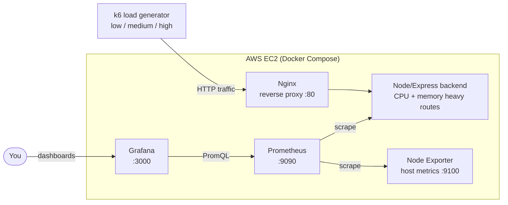

# LoadLab ⚡

**A Dockerized system built to fail on purpose.** LoadLab pairs an intentionally expensive Node/Express backend with a full observability stack, so you can push it over with k6 and watch exactly how, and where, it degrades.

Understanding how systems break is the best way to make them resilient. This project is a sandbox for practising SRE fundamentals: load testing, telemetry, bottleneck hunting and capacity limits, on real cloud infrastructure rather than `localhost`.

## Architecture



Traffic flows left to right through Nginx into the backend. Prometheus scrapes the backend and the host, and Grafana turns those metrics into live dashboards.

## Screenshots

| Grafana under **high** load | Prometheus targets |
|---|---|
|  |  |


## Key features

- **Intentionally expensive endpoints:** an Nginx-proxied Node/Express backend with routes designed to burn CPU and memory.
- **Three load profiles:** `k6` scripts simulate low, medium and high traffic intensity.
- **Real-time telemetry:** Prometheus and Grafana show server strain and response times as it happens.
- **Infrastructure as code:** one `terraform apply` provisions a hardened EC2 host and boots the whole stack.
- **Realistic remote testing:** deployed to AWS so load crosses a real network instead of loopback.

## Tech stack

| Layer | Tools |
|---|---|
| App | Node.js, Express, Nginx |
| Load testing | k6 |
| Observability | Prometheus, Grafana, Node Exporter |
| Packaging | Docker, Docker Compose |
| Cloud + IaC | AWS EC2, Terraform |

## Run it locally

```bash
git clone https://github.com/Mehulsri07/LoadLab.git
cd LoadLab
docker compose up -d --build
```

| Service | URL |
|---|---|
| App (via Nginx) | http://localhost |
| Grafana | http://localhost:3000 |
| Prometheus | http://localhost:9090 |

Then run a load profile from the `k6/` folder:

```bash
k6 run -e BASE_URL=http://localhost k6/<script>.js
```

Keep Grafana open while it runs. That's the fun part.

## Deploy to AWS with Terraform

The `terraform/` folder creates an Ubuntu 24.04 EC2 instance, an Elastic IP and a security group, then installs Docker and starts the stack via user data.

```bash
cd terraform
cp terraform.tfvars.example terraform.tfvars   # set admin_cidr to your IP, key_name to your key pair
terraform init
terraform plan
terraform apply
```

Give it a couple of minutes to boot, then use the printed `app_url` as the k6 target and `grafana_url` for dashboards. Tear it down when you're done so you're not paying for an idle box:

```bash
terraform destroy
```

Design choices worth knowing about:

- The app port (80) is public because it's the thing being load tested. **SSH, Grafana and Prometheus are restricted to `admin_cidr`**, and Terraform refuses `0.0.0.0/0` for it.
- IMDSv2 is enforced and the root volume is encrypted.
- `t3.small` is the default. `t3.micro` runs out of CPU credits quickly under high-intensity tests, which muddies your results.

## What to look for

Run low, then medium, then high, and compare:

- Where does p95 latency start to climb, and does it climb gradually or fall off a cliff?
- Which resource saturates first: CPU, memory, or Nginx connections?
- Once the error rate rises, does the system recover on its own when load drops?

Handy host-level queries (Node Exporter):

```promql
100 - (avg by (instance) (rate(node_cpu_seconds_total{mode="idle"}[1m])) * 100)
node_memory_MemAvailable_bytes / node_memory_MemTotal_bytes
```

## Related

- [loadlab-probe](https://github.com/Mehulsri07/loadlab-probe): a small Go service that probes the app and exports availability and latency metrics for Prometheus.
