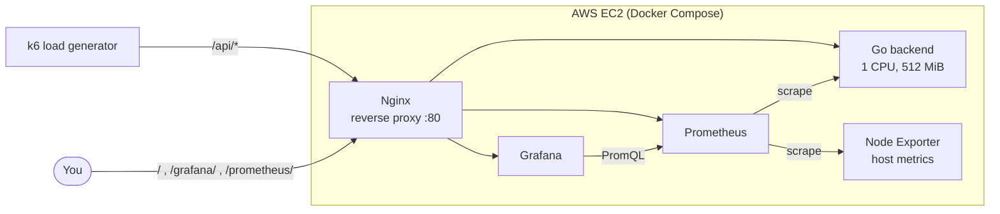

# LoadLab

**A Dockerized system built to fail on purpose.** LoadLab pairs an intentionally expensive Go backend with a full observability stack, so you can push it over with k6 and watch exactly how, and where, it degrades.

Understanding how systems break is the best way to make them resilient. This project is a sandbox for practising SRE fundamentals: load testing, telemetry, bottleneck hunting and capacity limits, on real cloud infrastructure rather than `localhost`.

## Architecture


```mermaid
flowchart LR
    K6["k6 load generator"]
    U(["You"])

    subgraph EC2["AWS EC2 (Docker Compose)"]
        N["Nginx<br/>reverse proxy :80"]
        B["Go backend<br/>1 CPU, 512 MiB"]
        NE["Node Exporter<br/>host metrics"]
        P["Prometheus"]
        G["Grafana"]
    end

    K6 -->|"/api/*"| N
    U -->|"/ , /grafana/ , /prometheus/"| N
    N --> B
    N --> G
    N --> P
    P -->|"scrape"| B
    P -->|"scrape"| NE
    G -->|"PromQL"| P
```

Nginx is the only container with a published port. It serves the dashboard page at `/`, proxies `/api/*` to the backend, and proxies Grafana and Prometheus under `/grafana/` and `/prometheus/`. Prometheus scrapes the backend and the host every 5 seconds.

<!--
SCREENSHOTS: uncomment this block once the images exist in docs/img/.
Do not uncomment it with missing files, or GitHub shows broken-image icons.

## Screenshots

| Grafana under **high** load | Prometheus targets |
|---|---|
|  |  |


-->

## Key features

- **Intentionally expensive endpoints:** a Go backend, instrumented with the Prometheus Go client, with routes designed to burn CPU, memory and time.
- **Hard resource limits:** every container has a CPU and memory cap, so the backend saturates at a known point and the monitoring stack survives when it does.
- **Dashboard as code:** Grafana's data source and the LoadLab dashboard are provisioned from files. `docker compose up` gives you the graphs with no clicking.
- **Four k6 scripts:** from a 10-user baseline to a 300-user stress test.
- **Realistic remote testing:** deployed to AWS so load crosses a real network instead of loopback.

## Tech stack

| Layer | Tools |
|---|---|
| App | Go, Nginx |
| Load testing | k6 |
| Observability | Prometheus, Grafana, Node Exporter |
| Packaging | Docker, Docker Compose |
| Cloud | AWS EC2 |

## Run it locally

```bash
git clone https://github.com/Mehulsri07/LoadLab.git
cd LoadLab
docker compose up -d --build
```

| Service | URL |
|---|---|
| Dashboard page | http://localhost |
| Backend API | http://localhost/api/health |
| Grafana (opens on the LoadLab dashboard) | http://localhost/grafana/ |
| Prometheus | http://localhost/prometheus/ |

Grafana allows anonymous read-only access. The default admin login is `admin` / `admin`.

## Backend endpoints

All routes are reached through Nginx under `/api/`.

| Route | What it does | What it stresses |
|---|---|---|
| `GET /api/health` | Returns `{"status":"ok"}` | Nothing; the baseline |
| `GET /api/cpu` | Counts primes up to 1,000,000 by trial division | One CPU core per request |
| `GET /api/memory` | Allocates a slice of 1,000,000 structs | Heap and garbage collector |
| `GET /api/slow` | Sleeps for 3 seconds | Open connections and goroutines |
| `GET /api/info` | Go version, uptime, environment | — |
| `GET /api/status` | Probes Prometheus and Grafana from inside the Docker network | — |
| `GET /api/metrics` | Prometheus metrics: request count and latency histogram per route | — |

## Load tests

Scripts target `http://localhost` by default. Pass `-e BASE_URL=...` to aim them elsewhere.

| Script | Load | Target |
|---|---|---|
| `k6/health-test.js` | 10 users for 1 minute | `/api/health` |
| `k6/cpu-test.js` | Ramps to 50 users over 2 minutes | `/api/cpu` |
| `k6/load-test.js` | Ramps to 100 users over 3 minutes | One route, chosen with `-e ROUTE=health\|cpu\|memory\|slow` |
| `k6/stress-test.js` | Ramps to 300 users over 8 minutes, no pause between requests | Random mix of health, memory, slow and cpu |

```bash
k6 run k6/health-test.js
```

```bash
k6 run -e ROUTE=memory k6/load-test.js
```

Keep Grafana open while a test runs. That's the fun part.

## Resource limits

Limits are set in `docker-compose.yml` and sized so the whole stack fits a 2 GB `t3.small`.

| Service | CPU | Memory |
|---|---|---|
| backend | 1.0 | 512 MiB |
| nginx | 0.5 | 128 MiB |
| prometheus | 0.5 | 384 MiB |
| grafana | 0.5 | 512 MiB |
| node-exporter | 0.25 | 64 MiB |

The backend is the part meant to break. When it exceeds 512 MiB the kernel kills it, and `restart: unless-stopped` brings it back, so you can watch both the failure and the recovery. Change the backend's numbers to see how the breaking point moves.

## Grafana dashboard

The LoadLab dashboard is defined in `monitoring/grafana/dashboards/loadlab.json` and loaded at startup.

| Panel | Shows |
|---|---|
| Request rate by route | Requests per second reaching the backend |
| Latency percentiles | p50, p95 and p99 across all routes |
| p95 latency by route | Which route is slow |
| Responses by status code | Status codes returned by the backend |
| Backend CPU | Cores in use; flat at 1.0 means saturated |
| Backend memory | Resident memory and Go heap against the 512 MiB limit |
| Goroutines | Roughly the number of in-flight requests |
| Backend up | Drops to 0 while the backend is restarting |
| Host CPU and memory | Whole-machine usage from Node Exporter |

Latency here is measured inside the backend. Time a request spends queueing in Nginx, and the 502/504 responses Nginx returns while the backend is down, only show up in k6's own summary. Comparing the two is part of the exercise.

The dashboard is read-only in the UI. To change it, edit the JSON file and restart Grafana.

## Deploy to AWS EC2

On an Ubuntu EC2 instance with Docker and Docker Compose installed, run the same three commands as above, then point k6 at the instance's public address from your own machine:

```bash
k6 run -e BASE_URL=http://<ec2-public-ip> k6/stress-test.js
```

Run k6 from a different machine than the one under test. On the same box, k6 competes with the backend for CPU and the numbers stop meaning anything.

Only port 80 needs to be open to the internet: the app, Grafana and Prometheus are all served through Nginx, and no other container port is published. Keep SSH (22) restricted to your own IP in the security group. Grafana's public URL is set by `GF_SERVER_ROOT_URL` and `GF_SERVER_DOMAIN` in `docker-compose.yml`; change them to your instance's address.

A `t3.small` is a good size: a `t3.micro` runs out of CPU credits quickly under the stress test, which muddies the results. Stop the instance when you're done so you're not paying for an idle box.

## What to look for

Run `health-test`, then `load-test` against one route at a time, then `stress-test`, and compare:

- Where does p95 latency start to climb, and does it climb gradually or fall off a cliff?
- Which resource saturates first: CPU, memory, or Nginx connections?
- Once the error rate rises, does the system recover on its own when load drops?
- How far apart are the latency k6 reports and the latency the backend reports?

Handy host-level queries (Node Exporter):

```promql
100 - (avg by (instance) (rate(node_cpu_seconds_total{mode="idle"}[1m])) * 100)
node_memory_MemAvailable_bytes / node_memory_MemTotal_bytes
```

## Tear down

```bash
docker compose down
```

Add `-v` to also delete Grafana's stored data.

## Related

- [loadlab-probe](https://github.com/Mehulsri07/loadlab-probe): a small Go service that probes the app and exports availability and latency metrics for Prometheus.
