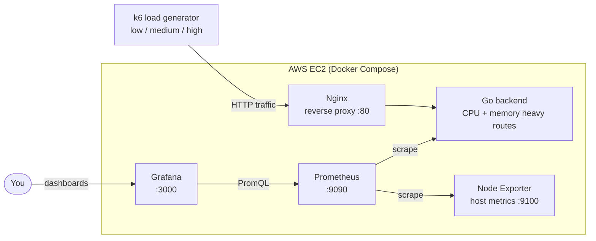

# LoadLab

**A Dockerized system built to fail on purpose.** LoadLab pairs an intentionally expensive Go backend with a full observability stack, so you can push it over with k6 and watch exactly how, and where, it degrades.

Understanding how systems break is the best way to make them resilient. This project is a sandbox for practising SRE fundamentals: load testing, telemetry, bottleneck hunting and capacity limits, on real cloud infrastructure rather than `localhost`.

## Architecture


```mermaid
flowchart LR
    K6["k6 load generator<br/>low / medium / high"]
    U(["You"])

    subgraph EC2["AWS EC2 (Docker Compose)"]
        N["Nginx<br/>reverse proxy :80"]
        B["Go backend<br/>CPU + memory heavy routes"]
        NE["Node Exporter<br/>host metrics :9100"]
        P["Prometheus<br/>:9090"]
        G["Grafana<br/>:3000"]
    end

    K6 -->|"HTTP traffic"| N
    N --> B
    P -->|"scrape"| B
    P -->|"scrape"| NE
    G -->|"PromQL"| P
    U -->|"dashboards"| G
```

Traffic flows left to right through Nginx into the backend. Prometheus scrapes the backend and the host, and Grafana turns those metrics into live dashboards.

<!--
SCREENSHOTS: uncomment this block once the images exist in docs/img/.
Do not uncomment it with missing files, or GitHub shows broken-image icons.

## Screenshots

| Grafana under **high** load | Prometheus targets |
|---|---|
|  |  |


-->

## Key features

- **Intentionally expensive endpoints:** an Nginx-proxied Go backend (instrumented with the Prometheus Go client) with routes designed to burn CPU and memory.
- **Three load profiles:** `k6` scripts simulate low, medium and high traffic intensity.
- **Real-time telemetry:** Prometheus and Grafana show server strain and response times as it happens.
- **Realistic remote testing:** deployed to AWS so load crosses a real network instead of loopback.

## Tech stack

| Layer | Tools |
|---|---|
| App | Go, Nginx |
| Load testing | k6 |
| Observability | Prometheus, Grafana, Node Exporter |
| Packaging | Docker, Docker Compose |
| Cloud | AWS EC2 |

## Run it locally

```bash
git clone https://github.com/Mehulsri07/LoadLab.git
cd LoadLab
docker compose up -d --build
```

| Service | URL |
|---|---|
| App (via Nginx) | http://localhost |
| Grafana | http://localhost/grafana/ |
| Prometheus | http://localhost/prometheus/ |

Then run a load profile from the `k6/` folder:

```bash
k6 run -e BASE_URL=http://localhost k6/<script>.js
```

`k6/load-test.js` ramps to 100 users against a single route; pick it with `-e ROUTE=cpu` (or `health`, `memory`, `slow`).

Keep Grafana open while it runs. That's the fun part.

## Deploy to AWS EC2

On an Ubuntu EC2 instance with Docker and Docker Compose installed, run the same three commands as above, then point k6 at the instance's public address from your own machine:

```bash
k6 run -e BASE_URL=http://<ec2-public-ip> k6/<script>.js
```

Only port 80 needs to be open to the internet: the app, Grafana (`/grafana/`) and Prometheus (`/prometheus/`) are all served through Nginx, and no other container port is published. Keep SSH (22) restricted to your own IP in the security group. Grafana's public URL is set by `GF_SERVER_ROOT_URL` and `GF_SERVER_DOMAIN` in `docker-compose.yml`; change them to your instance's address. A `t3.small` is a good size: a `t3.micro` runs out of CPU credits quickly under the high-intensity profile, which muddies the results. Stop the instance when you're done so you're not paying for an idle box.

## What to look for

Run low, then medium, then high, and compare:

- Where does p95 latency start to climb, and does it climb gradually or fall off a cliff?
- Which resource saturates first: CPU, memory, or Nginx connections?
- Once the error rate rises, does the system recover on its own when load drops?

Handy host-level queries (Node Exporter):

```promql
100 - (avg by (instance) (rate(node_cpu_seconds_total{mode="idle"}[1m])) * 100)
node_memory_MemAvailable_bytes / node_memory_MemTotal_bytes
```

## Related

- [loadlab-probe](https://github.com/Mehulsri07/loadlab-probe): a small Go service that probes the app and exports availability and latency metrics for Prometheus.
